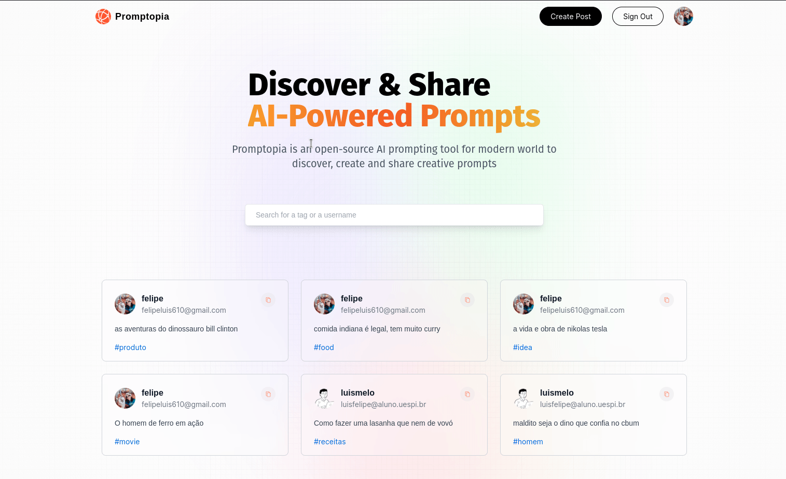

  <a href="#-tecnologias">Tecnologias</a>&nbsp;&nbsp;&nbsp;|&nbsp;&nbsp;&nbsp;
  <a href="#-projeto">Projeto</a>&nbsp;&nbsp;&nbsp;|&nbsp;&nbsp;&nbsp;
  <a href="#-layout">Layout</a>&nbsp;&nbsp;&nbsp;|&nbsp;&nbsp;&nbsp;
  <a href="#memo-licença">Licença</a>

 

  

 

  

## 🚀 Tecnologias

Esse projeto foi desenvolvido com as seguintes tecnologias:

- Next.js
- Tailwildcss
- Google oAuth
- MongoDB
- NPM
- Vercel

## 💻 Projeto

Esse projeto foi feito com intuito de praticar o framework Next.js. O projeto consiste de um repositório de prompts para usar em IAs. O usuário é capaz de criar, editar e deletar um prompt. 

Esse projeto foi feito durante um curso do canal do Javascript Mastery presente [nesse link](https://www.youtube.com/watch?v=wm5gMKuwSYk). Além disso, fiz como um extra o desenvolvimento das seguintes features:
- Buscar pelo nome do prompt
- Buscar pela tag do prompt
- Implementei o click na tag para buscar por tags correlatas
- Implementei a visualização de perfis de outros usuários

Foi feito o deploy do site desenvolvido utilizando a plataforma Vercel, você pode acessar através [desse link](https://share-prompts-op9ac9c3d-felipe-dot.vercel.app/)

## 👨‍💻 Como-rodar-o-projeto

Você precisa ter o <strong>Node.js</strong> instalado na sua máquina. Senão tiver você pode fazer o download através [desse link](https://nodejs.org/en/download/).

Com o Node instalado na máquina, vc precisa apenas de 2 comandos (no terminal) na pasta do projeto, nessa ordem:
1. `npm install` -> Para instalar as dependências do projeto. (só precisa ser executado uma vez) 
2. `npm run dev` -> Para iniciar o servidor local (para acessar o projeto via navegador, digite na barra de endereço o endereço que aparecerá no terminal) 

## :memo: Licença

Esse projeto está sob a licença MIT. Veja o arquivo [LICENSE](LICENSE) para mais detalhes.

---

Feito com ♥ by Felipe Melo